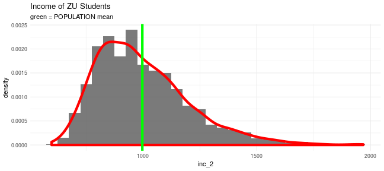
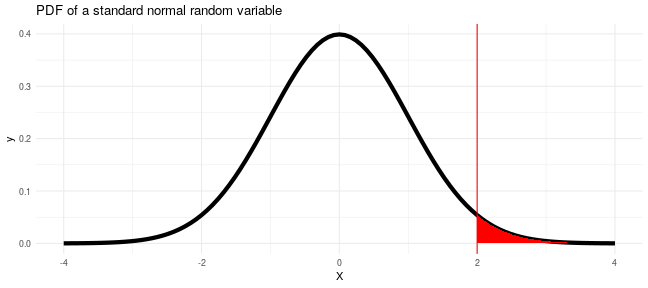

# Introduction

This section covers a fundamental part of inference: hypothesis testing. Tests of hypotheses are frequently applied in econometrics, e.g. T-tests for OLS parameters or in tests for heteroscedasticity.

Since we're interested in practical application, we will introduce this topic with a simulation.

Our gratitude goes to Marcel Schliebs for providing this simulation example.


# Simulation

We begin by loading the required packages. For ease of programming we use the `tidyverse` package, a comprehensive toolset for data analysis.

```r
library(tidyverse)
library(ggplot2)
```

## Our Simulated Population
First we simulate a population that represents the monthly income of ZU Students. Consider the data we now simulate as our **population**. Of course, in reality we don't know the distribution monthly income of ZU students.


```r
set.seed(11) # seed for reproducibility

n <- 1200
inc_2 <- fGarch::rsnorm(n, mean = 1000, sd = 200, xi = 2.0)

ggplot() +
geom_histogram(aes(x = inc_2,
y = ..density..),binwidth = 50,alpha = 0.8) +
geom_density(aes(x = inc_2,
y = ..density..),col = "red",size = 2,alpha = 0.8) +
labs(title = "Income of ZU Students",
subtitle = "green = POPULATION mean") +
geom_vline(xintercept = mean(inc_2),color = "green",size = 2) +
theme_minimal()
```



Notice how our population is **not normally distributed**. In econometrics, normality is often an assumption that is required for conducting inference. E.g. it is assumed that our OLS-residuals are normally distributed.

As we will see in this example, the *normality assumption* is not neccessary if we deal with expected values in a specific way. 

## Sampling

Usually we work with samples of our population of interest, hoping that the analysis of the sample gives us some clues about the population (aka inference.)

First we demonstrate how a single sample is simulated and what clues about the population it can give us:


```r
set.seed(1337)
sample_2 <- sample(x = inc, size = 50, replace = F)
```

```
## Error in sample(x = inc, size = 50, replace = F): object 'inc' not found
```


```r
ggplot() +
geom_histogram(aes(x = sample_2,
y = ..density..),binwidth = 50,alpha = 0.8) +
labs(title = "SAMPLE Histogram Income ZU Students",
subtitle = paste0("green = population mean, ",  "red = SAMPLE mean:",mean(sample_2) %>% round(2)," with sd: ",sd(sample_2) %>% round(2))) +
geom_vline(xintercept = mean(sample_2),color = "red",size = 2) +
  geom_vline(xintercept = mean(inc),color = "green",size = 2)+
theme_minimal()
```

```
## Error in mean(sample_2): object 'sample_2' not found
```

Based on this single sample, we would guess that the mean monthly income of ZU students is ca. $950 €$, with a standard deviation of roughly $200 €$. This is quite close to the true (population) mean. But how can we be sure that our estimated sample mean is not too far away from the population mean?

To answer these questions, we make use of the **Central Limit Theorem**:

> The mean from a random sample for *any* population, when standardised, has an asymptotic standard normal distribution.

This means, if we could obtain an estimate of the variance (or standard deviation) of our sample mean, and assume a given population mean, we can make a statement of how likely it is to observe our given sample mean.

Let's break this down.

### Hypothesis Test for a Standard Normal Variable

Lets take it as given that a variable follows the standard normal distribution. Since we know the pdf of the standard normal distribution, we can calculate the probability of the variable realising any particular value.

We can also do this graphically:


```r
ggplot(data =  data.frame(X = -4:4), aes(x=X)) +
  stat_function(fun = dnorm, args = list(mean = 0, sd = 1), size = 2) +
  geom_vline(xintercept = 2, color = "red") +
  labs(title = "PDF of a standard normal random variable") +
  stat_function(fun = dnorm, xlim = c(2,4), geom = "area", fill = "red")+
  theme_minimal()
```



The pdf tells us the probability of a particual observation, or, alternatively, the probability of observing values greater than a particular observation.

E.g., the probability of observing values of $X$ greater than $2$ is 

```r
dnorm(2)
```

```
## [1] 0.05399097
```
which corresponds to the red area under the curve.
